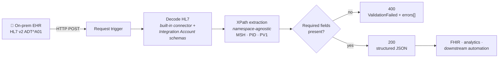

<sub>[← All articles](../../README.md)</sub>

# Azure Logic Apps for HL7 ADT
### Decoding hospital admission messages without hand-written parsers

> HL7 v2 still runs patient flow in most hospitals. Logic Apps can bring it into the cloud without a single `split('|')`.

[](https://www.linkedin.com/pulse/leveraging-azure-logic-apps-hl7-adt-tony-honesto-qa9ac/)
[](https://github.com/atonyhonesto/logicapp-hl7-adt-a01-decoder)

`Published February 20, 2026` · `Healthcare IT` · `Azure Logic Apps` · `HL7 v2`

---

## TL;DR

- **ADT messages** (admit, discharge, transfer) drive patient flow, billing and clinical decisions across EHR, lab and billing systems.
- A **Logic App Standard** workflow uses the built-in **Decode HL7** action to turn HL7 v2 into XML, then **XPath** to pull out the fields.
- Once decoded, the data can feed **FHIR APIs, analytics and automation** instead of staying locked in a legacy interface.

## The workflow



## From pipes to JSON

```text
MSH|^~\&|ADT1|GOOD HEALTH HOSPITAL|EHR|HOSPITAL|202401011200||ADT^A01|MSG00001|P|2.5
PID|1||123456^^^HOSPITAL^MR||Doe^John||19800101|M|||123 Main St^^Metropolis^NY^10001||555-123-4567
PV1|1|I|2000-2012-01||||1234^Smith^Adam
```

```json
{
  "messageHeader": { "messageType": "ADT^A01", "messageControlId": "MSG00001", "hl7Version": "2.5" },
  "patient": { "patientId": "123456", "firstName": "John", "lastName": "Doe", "gender": "M" },
  "visit": { "patientClass": "I", "location": "2000-2012-01",
             "attendingDoctor": { "doctorId": "1234", "firstName": "Adam", "lastName": "Smith" } }
}
```

<sub>Sample data is synthetic.</sub>

## Why it matters

| | |
|---|---|
| **Standardised handling** | Receive, decode and route without manual parsing |
| **Scalable automation** | High-volume admission and transfer events, event-driven |
| **Cloud-native interoperability** | Move on-prem interfaces to Azure and stay HL7-compliant |
| **Gateway to modern APIs** | Decoded messages map onward to FHIR, storage and analytics |

## Thoughts to ponder

1. **How do you balance HL7 v2 with FHIR?** v2 still owns real-time clinical events; FHIR is winning for records and APIs. Translation layers are the bridge.
2. **What does serverless change?** Less infrastructure, but reliability, HIPAA compliance and traceability have to be designed in.
3. **Is decoding enough?** Enrichment and normalisation are where the analytics and decision-support value is.
4. **How do you prove it's auditable?** In healthcare every integration layer must be logged, secure and compliant from day one.

---

<sub>Related: [Matillion and BizTalk](../2026-06-matillion-and-biztalk/README.md) · [Microsoft Integration Accounts now enhanced in Logic Apps](https://www.linkedin.com/pulse/microsoft-integration-accounts-now-enhanced-logic-apps-tony-honesto-zwucc/) · [Microsoft Entra ID](https://www.linkedin.com/pulse/microsoft-entra-id-tony-honesto-srp8c/)</sub>
