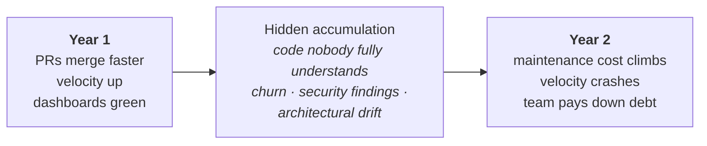
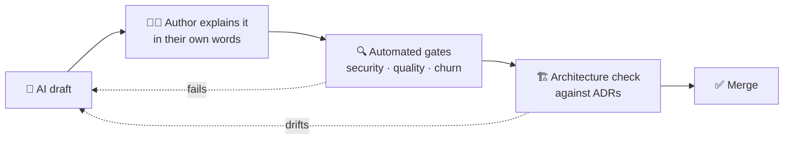

[← All articles](../../README.md)

# The AI Coding Tax
### Stop AI tools from quietly accumulating technical debt

> Year 1 with AI coding tools feels unstoppable. Year 2 is when the bill arrives.

`Published May 20, 2026` · `Software engineering` · `AI-assisted development` · `Code quality`

---

## TL;DR

- AI tools speed up the part of software work that was never the bottleneck: typing code. **Understanding** and **debugging** code are the bottlenecks.
- The debt isn't avoided, it's **deferred with interest**, and it comes in five distinct flavours that need different fixes.
- The answer isn't to stop using AI. It's to **treat AI output as a first draft from a very fast junior developer**.

## The curve

## The five flavours of AI technical debt

| Debt | What it looks like | The fix |
|---|---|---|
| 🧠 **Comprehension** | Code merged that nobody can explain. Green tests hide it until the author leaves. | Review AI output like a junior's PR. If you can't explain it, don't merge it. |
| 🔁 **Churn** | Lines rewritten within two weeks of being written. You didn't ship faster, you shipped twice. | Track AI-touched churn as a first-class metric; route heavily AI-generated files to senior review. |
| 🔓 **Security** | Models have a *completion* posture, not a *security* posture. | Mandatory scanning on AI-touched files (SonarQube, Snyk, Semgrep) before main. |
| 🏗️ **Architecture** | Locally clever code that breaks bounded contexts and ADRs. | Feed Architecture Decision Records to the tool; justify any change to boundaries or data models. |
| 🧩 **Cognitive** | Engineers stop building their own mental models. | Authors explain AI-generated code in their own words in the PR: what, edge cases, why. |

## What good governance looks like

## Thoughts to ponder

1. **Velocity without comprehension is an illusion.** Measure quality, churn and incidents alongside output.
2. **The "AI slop" crisis is a code-review crisis.** Production rate went up, so review has to scale with it, not shrink.
3. **Your quality gates weren't built for this.** Static analysis was tuned for human patterns; AI introduces new ones.
4. **Put the debt in the business case.** An honest AI-tooling ROI accounts for paying the debt down.
5. **Winners won't stop using AI; they'll use it differently.** Spend the time AI saves on the parts of the craft that need a human.

---

Related: [Claude Code MCPs](https://www.linkedin.com/pulse/claude-code-mcps-tony-honesto-v3loc/) · [Enforcing Java Coding Standards with SonarQube](https://www.linkedin.com/pulse/enforcing-java-coding-standards-sonar-sonarqube-tony-honesto-ku4lc/) · [ChatGPT vs Codex for a Product Requirement](https://www.linkedin.com/pulse/chatgpt-vs-codex-product-requirement-tony-honesto-rcgbc/)
