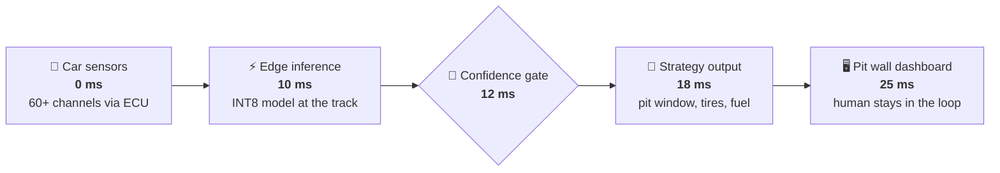
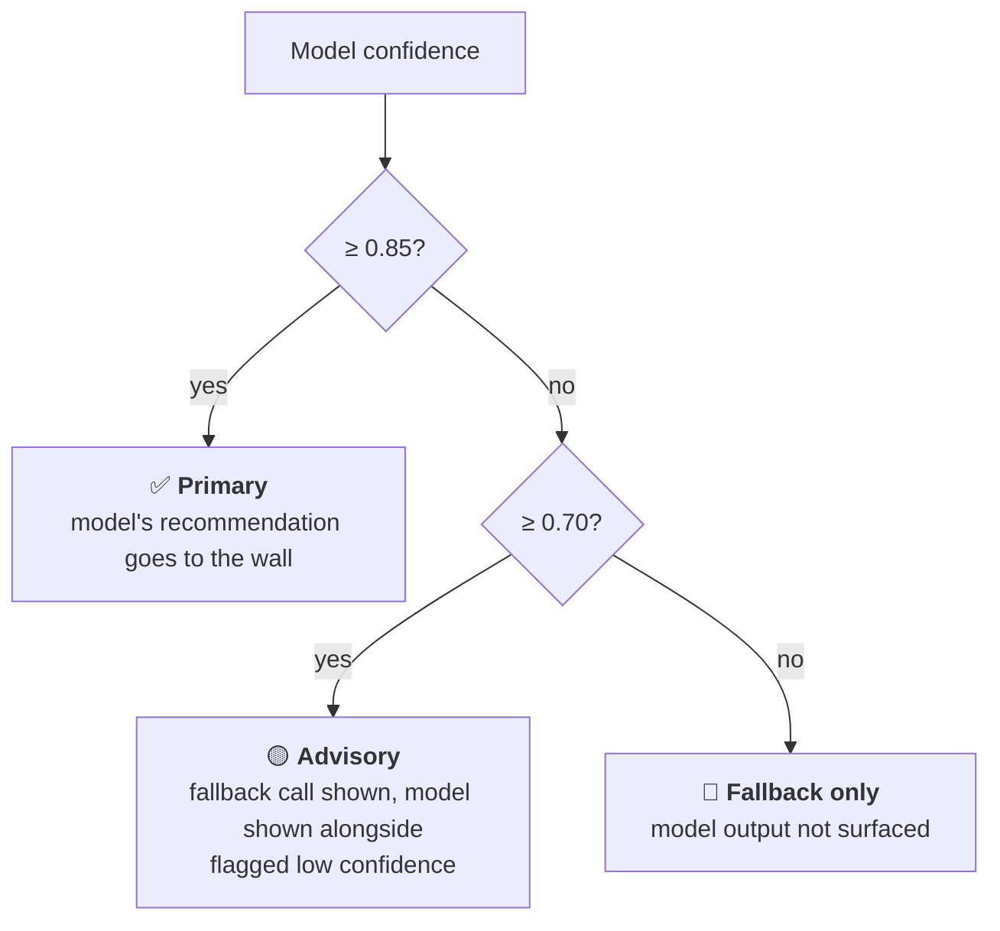
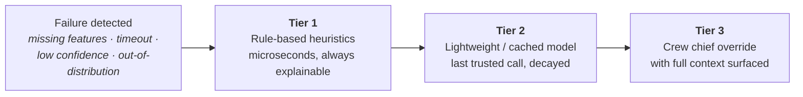

[← All articles](../../README.md)

# AI/ML at Race Speed
### Low-latency inference, confidence thresholds & fallback logic

> A pit stop takes about 11 seconds. The AI advising it gets about **25 milliseconds**.

`Published May 8, 2026` · `Machine learning` · `Edge AI` · `Motorsports`

---

## TL;DR

- **Fast is a system property, not a model property.** An 8 ms model inside a 40 ms pipeline is a 48 ms system that missed the window.
- **A confidence score is only useful if it's calibrated** and if there's a gate that acts on it.
- **The fallback isn't a failure mode, it's a feature.** A safe call has to reach the wall every lap, whether or not the model is sure.

## The 25 ms budget

## Getting a model under 10 ms

| Technique | What it does |
|---|---|
| **INT8 quantization** | 32-bit weights become 8-bit; less memory, faster math |
| **Pruning** | Drops low-value weights (often 20–40%) with little accuracy loss |
| **ONNX Runtime graph optimisation** | Operator fusion, kernel tuning and memory pooling |
| **Early-exit networks** | Easy inputs leave after fewer layers; hard ones get the full depth |
| **Distillation** | A small student model learns to imitate a large teacher |

## The dual-threshold gate

On top of the static thresholds, **distributional-shift detection** watches for race conditions unlike anything in training (unusual weather, odd caution patterns, a new track layout), where confidence scores can't be trusted.

## When the model doesn't know: three-tier fallback

Around all of it: **every prediction logged** with features, confidence and outcome for post-race retraining, plus replicated serving and health checks so the system degrades to rules rather than going dark.

## Thoughts to ponder

1. **"Fast enough" is a system property.** Budget the whole path from sensor to signal, not just the forward pass.
2. **Confidence without calibration is noise.** A model that says 91% and is right 60% of the time can *suppress* the fallback that would have protected you. Temperature scaling, Platt scaling and conformal prediction are production requirements.
3. **The fallback is a feature.** Measure whether each activation produced a safe, useful call, not how rarely it fired.
4. **Safety-critical ML is its own discipline:** certifiable, performant, safe, sustainable and explainable, all at once.
5. **Edge-first is a reliability architecture.** Track RF is crowded; the cloud is the analytics layer, not the critical path.

## See it running

The companion repo implements this whole design in dependency-free Python: per-stage deadlines, a hard inference timeout, the 0.70/0.85 gate, temperature scaling, drift detection, the three fallback tiers and a JSON audit log, with a simulated 200-lap race and 15 tests.

**→ [atonyhonesto/race-speed-inference](https://github.com/atonyhonesto/race-speed-inference)**

---

Related: [Machine Learning Approaches for Motorsports Competitive Advantage](https://www.linkedin.com/pulse/machine-learning-approaches-motorsports-competitive-tony-honesto-agstc/) · [Motorsports: Streaming Telemetry & Real-Time Performance](https://www.linkedin.com/pulse/motorsports-streaming-telemetry-real-time-tony-honesto-rfexc/) · [Winning in NASCAR with AI/ML](https://www.linkedin.com/pulse/winning-nascar-aiml-tony-honesto-tkdvc/)
