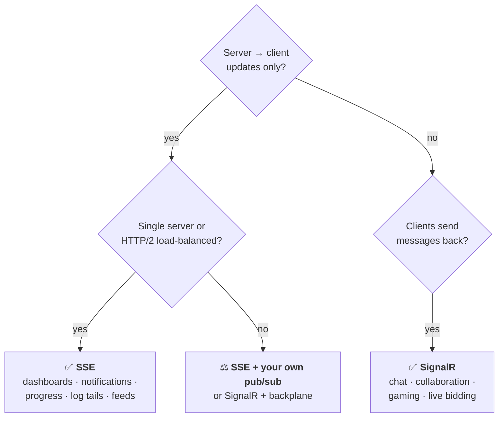

<sub>[← All articles](../../README.md)</sub>

# SignalR vs .NET 10 Server-Sent Events
### Real-time communication: pick the lightest tool that solves the problem

> .NET 10 makes SSE a one-liner. That's great news, and it still doesn't replace SignalR.

[](https://www.linkedin.com/pulse/signalr-vs-net-10-server-sent-events-real-time-tony-honesto-ofigc/)

`Published May 22, 2026` · `.NET 10` · `ASP.NET Core` · `Real-time systems`

---

## TL;DR

- **SSE is one-way:** server pushes, client listens. For dashboards, notifications, progress bars and log tails, it's now an excellent default.
- **SignalR is a platform:** bidirectional messaging, hubs and groups, scale-out backplanes and transport fallback.
- **Choose by communication pattern, not by library.** Most enterprise "real-time" is push-only. The features that aren't still need SignalR.

## What .NET 10 gives you

```csharp
app.MapGet("/events", (CancellationToken ct) =>
{
    var events = GetLiveEventsAsync(ct);          // IAsyncEnumerable<T>
    return TypedResults.ServerSentEvents(events, eventType: "update");
});
```

No client library, no hub protocol, no transport negotiation. The browser's `EventSource` reconnects on its own and resumes with `Last-Event-ID`, and HTTP/2 multiplexing removes the old six-connections-per-host ceiling.

## The six gaps

| | Server-Sent Events | SignalR |
|---|---|---|
| **Direction** | Server → client only | Bidirectional |
| **Groups / users** | Build it yourself | `Clients.Group()`, `Clients.User()` built in |
| **Multi-server scale-out** | Build your own pub/sub | Redis backplane or Azure SignalR Service |
| **Transport fallback** | SSE or nothing | WebSockets → SSE → long polling |
| **Delivery semantics** | `Last-Event-ID` resume only | Connection-state protocol; pairs naturally with a durable queue |
| **Client constraints** | `EventSource`: GET only, no custom headers, text only | Auth, binary payloads, typed client API |

## The decision framework



## Thoughts to ponder

1. **"Real-time" isn't one thing.** A dashboard refresh, a 20-person document edit and a 60 Hz game loop are different problems.
2. **Complexity budget is a real constraint.** Don't pay SignalR's footprint for a metrics push, or skimp on it for a whiteboard.
3. **The backplane is a design-time decision.** If you'll scale horizontally, decide on coordination before the first hub or endpoint.
4. **SignalR's successor isn't SSE, it's the right architecture for the problem.** Ask what pattern the feature needs, then pick the tool.
5. **A decade of production history still counts.** SignalR's failure modes and scaling playbook are well documented.

---

<sub>Related: [Real-Time Applications with SignalR](https://www.linkedin.com/pulse/real-time-applications-signair-tony-honesto-4celc/) · [gRPC Still Matters](https://www.linkedin.com/pulse/grpc-still-matters-tony-honesto-rdexc/) · [Pub/Sub with AWS AppSync](https://www.linkedin.com/pulse/pubsub-aws-appsync-tony-honesto-qy7cc/) · [Azure AI Foundry + Azure Functions + SignalR](https://www.linkedin.com/pulse/azure-ai-foundry-functions-signalr-tony-honesto-pmb6f/)</sub>
