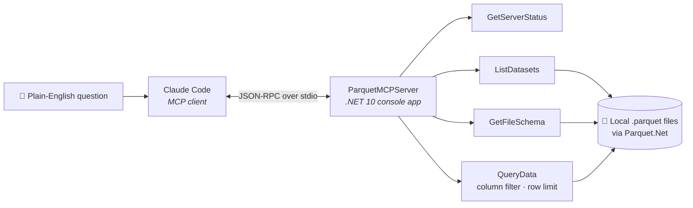
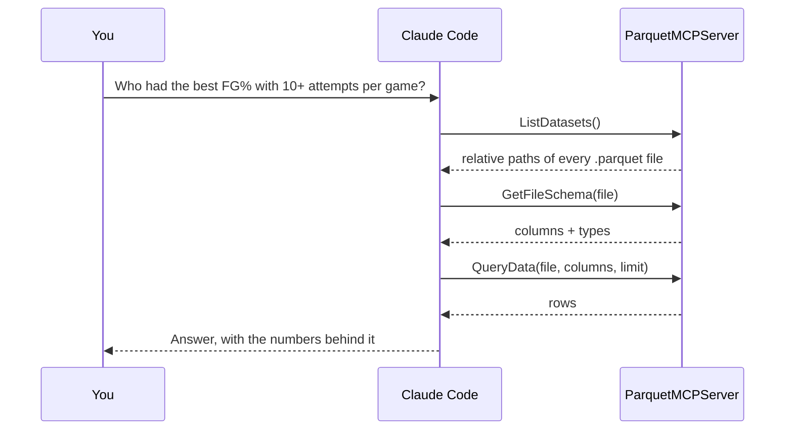

[← All articles](../../README.md)

# A Local C# MCP Server for Parquet Data
### Ask questions of your data in plain English, no SQL required

> "Who blocked the most shots across all 7 games?" Claude Code works out the tool calls; the data never leaves the machine.

`Published June 29, 2026` · `C# / .NET 10` · `Model Context Protocol` · `Claude Code`

---

## TL;DR

- A **.NET console app** exposes Parquet files to any MCP client over **stdio**.
- **Claude Code** discovers the schema first, then queries only the rows it needs.
- **Local-first:** Parquet on a local drive, no cloud dependency in the data layer.

## Architecture

## How a question becomes tool calls

## Design choices worth noting

| Choice | Why |
|---|---|
| **stdio transport** | Simplest MCP transport for a local tool; no ports or auth to manage |
| **File logger instead of console** | stdout carries the protocol, so logs go to `mcp-server.log` |
| **Schema before rows** | The model learns the shape of the data before touching it |
| **Row cap (default 100, max 1,000)** | Keeps responses inside the model's context and the query cheap |
| **Parquet.Net pinned to 5.6.0** | v6 introduced breaking API changes |
| **`PARQUET_DATA_DIR` env var** | Point the same build at any dataset |

---

Related: [Claude Code MCPs](https://www.linkedin.com/pulse/claude-code-mcps-tony-honesto-v3loc/) · [Parquet for Analytics & Feature Consumption](https://www.linkedin.com/pulse/parquet-analytics-feature-consumption-tony-honesto-oww7c/) · [Agent Reach](https://www.linkedin.com/pulse/agent-reach-give-your-ai-eyes-see-entire-internet-tony-honesto-vemkc/)
