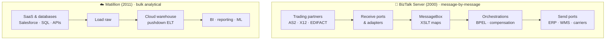
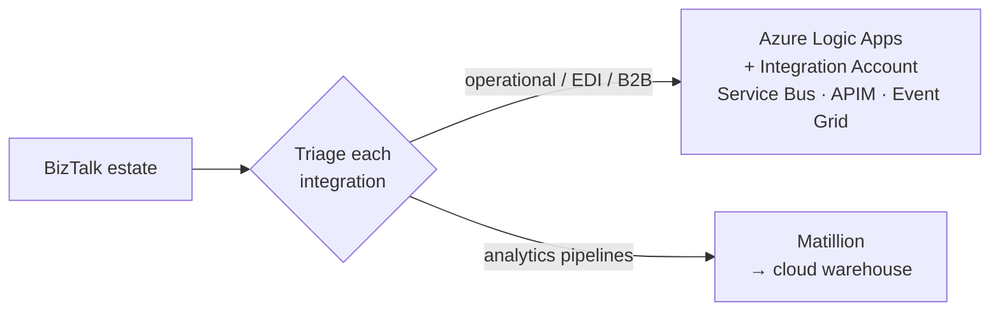

[← All articles](../../README.md)

# Matillion and BizTalk
### Two platforms, one purpose

> One is a cloud-native ELT tool from 2011. The other is Microsoft middleware from 2000. Ask either what it does and you get the same answer.

`Published June 2, 2026` · `Enterprise integration` · `EDI` · `Data engineering`

---

## TL;DR

- Both platforms **connect disparate systems, transform data between them and orchestrate the processes that depend on it**.
- **BizTalk** is operational middleware: guaranteed delivery, EDI with trading partners, long-running orchestrations. It reaches end of support in **April 2030**, and Microsoft points customers to **Azure Logic Apps**.
- **Matillion** is analytics ELT: pushdown transformations inside Snowflake, BigQuery, Redshift or Databricks.

## Same problem, two eras

## The seven shared pillars

| Pillar | BizTalk | Matillion |
|---|---|---|
| Integration at scale | Enterprise application integration | Cloud data integration |
| Visual design | Orchestration designer | Drag-and-drop job designer |
| Transformation | XSLT visual mapper | SQL / components in the warehouse |
| Connectivity | SAP, Oracle, MQ, AS2, SFTP, SQL Server adapters | 100+ SaaS and warehouse connectors |
| Orchestration | BPEL-compatible, long-running transactions | Dependent jobs, branching, failure routing |
| Monitoring | Business Activity Monitoring (BAM) | Job history, logs, alerting |
| Triggers | Message arrival on receive ports | Schedules, dependencies, events |

## The modernization path

## Thoughts to ponder

1. **The problem never changed, only the technology did.** Start from the kind of integration you need, not from which platform is newer.
2. **Legacy is often legacy because it worked.** Two decades of billions of messages is a success story whose time has come.
3. **The cloud warehouse changed what "integration" means.** For BI and ML, the integration layer needs to be warehouse-native.
4. **AI is widening the gap.** Agentic pipeline assistants and Copilot-designed workflows exist in the cloud; on-prem has no equivalent.
5. **Migration is a strategy, not an event.** Large estates can take a year; triage by type and start before the 2030 deadline forces it.

## From the field

I led a BizTalk-to-Azure Integration Services migration for a logistics company's high-volume EDI platform. The program write-up covers roadmap, parallel runs, cutover and the team's skills transition:

**→ [atonyhonesto/biztalk-azure-modernization](https://github.com/atonyhonesto/biztalk-azure-modernization)**

---

Related: [Microsoft Integration Accounts now enhanced in Logic Apps](https://www.linkedin.com/pulse/microsoft-integration-accounts-now-enhanced-logic-apps-tony-honesto-zwucc/) · [Leveraging Azure Logic Apps for HL7 ADT](../2026-02-logic-apps-hl7-adt/README.md) · [Snowflake and Databricks](../2026-06-snowflake-and-databricks/README.md)
