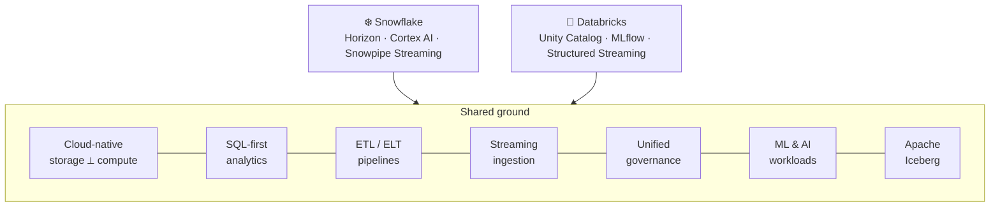
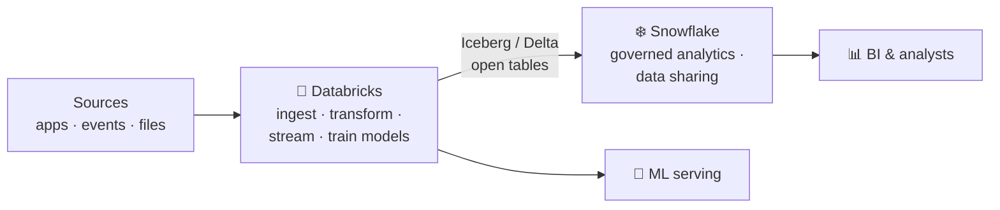

[← All articles](../../README.md)

# Snowflake and Databricks
### Two platforms, one data universe

> They're more alike than either company's marketing suggests, and the differences that remain are architectural, not cosmetic.

`Published June 3, 2026` · `Data platforms` · `Lakehouse` · `Data engineering`

---

## TL;DR

- By 2026 both platforms cover **SQL analytics, pipelines, streaming, governance and ML**. "Which one?" is increasingly the wrong question.
- The real split is **where your data lives**: Snowflake-managed storage vs. open Delta/Parquet files in your own cloud account. That's a five-year bet.
- Mature teams often **run both**, routing each workload to the platform that does it best.

## Where they converge

## Where they diverge

| | ❄️ Snowflake has the edge | 🧱 Databricks has the edge |
|---|---|---|
| **Sweet spot** | Governed, analyst-facing BI | Data science, ML, heavy engineering |
| **Experience** | Fully managed; no clusters to tune | Flexible; more knobs, more skill required |
| **Concurrency** | Multi-cluster warehouses absorb dashboard spikes | |
| **Streaming** | | Exactly-once Structured Streaming, Change Data Feed |
| **Storage** | Snowflake-managed micro-partitions | Open Delta/Parquet in your own S3 / ADLS / GCS |
| **Sharing** | Data Marketplace, live cross-org sharing | |
| **New in 2026** | | Lakebase: serverless Postgres OLTP next to analytics |

## A deliberate "both" architecture

## Thoughts to ponder

1. **"Snowflake vs. Databricks" is increasingly the wrong question.** Start from your workloads, then pick.
2. **Architecture is a five-year bet, not a feature checklist.** Data ownership and lock-in compound over time.
3. **Total cost includes people.** Lower compute bills can be offset by a higher skill bar; model platform and team cost together.
4. **The AI race between them will shape the next decade.** Where your AI workloads live may decide your data architecture.
5. **The best architectures often use both,** with open table formats making the hand-off practical.

---

Related: [Matillion and BizTalk](../2026-06-matillion-and-biztalk/README.md) · [Azure Databricks AI/BI Genie](https://www.linkedin.com/pulse/azure-databricks-aibi-genie-tony-honesto-bvric/) · [Databricks APIs and AI Apps](https://www.linkedin.com/pulse/databricks-apis-ai-apps-tony-honesto-ooxgc/) · [Parquet for Analytics & Feature Consumption](https://www.linkedin.com/pulse/parquet-analytics-feature-consumption-tony-honesto-oww7c/)
