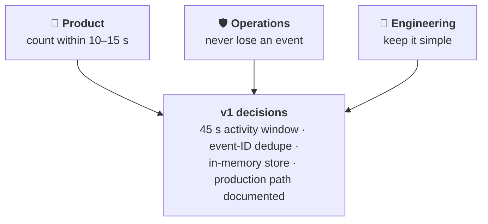
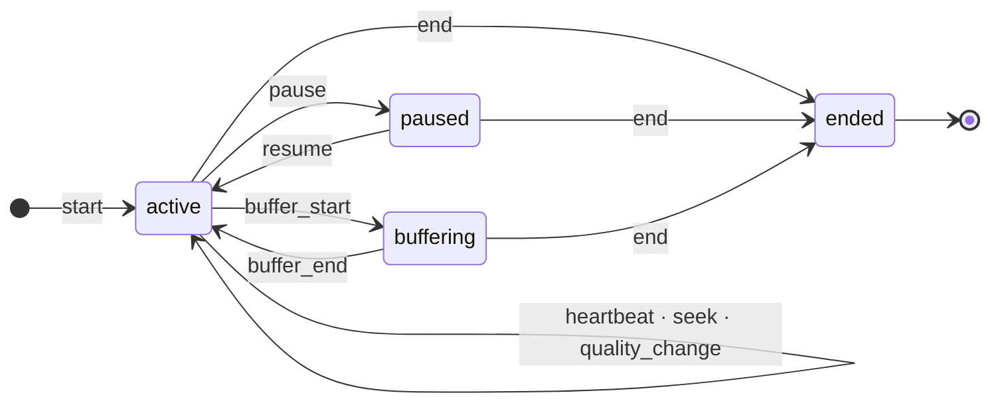

[← All articles](../../README.md)

# Three Stakeholders, One Proof of Concept
### Building a real-time watch session tracker, and what to do when the asks collide

> "How many people are watching this match right now?" sounds like a one-line query. On a live sports stream it's a moving target.

`Published October 2026` · `TypeScript` · `Node.js` · `Real-time systems` · `Sports streaming`

---

## TL;DR

- A small TypeScript service ingests player events and answers two questions: **how many sessions are active for an event right now**, and **what one viewer's session looks like**.
- Three demands pulled against each other: **Product** wanted counts within 10–15 seconds, **Operations** wanted zero lost events, **Engineering** wanted it simple.
- The v1 picks simplicity, makes the trade-offs explicit, and was **built twice**: once with zero runtime dependencies, once with Express, Zod and Supertest.

## The tension

## Nine player events, four session states

A session counts as **watching** while it is not ended and the service heard from it in the last **45 seconds**: one 30-second heartbeat plus a 15-second grace. Paused and buffering viewers still count.

## The decisions

| Demand | What the v1 does | What it leaves open |
|---|---|---|
| **Close to real time** | 45 s window on `receivedAt`; an `end` event drops a viewer at once | A viewer who closes the tab counts for up to 45 s, past the 10–15 s target |
| **Don't lose events** | Unique `eventId` dedupe: new → `202`, retry → `200` with `accepted: false` | State is in memory; a restart loses it. Production path: durable queue, shared store, replay, backpressure |
| **Keep it simple** | One process, three endpoints, five tests | Horizontal scaling needs shared state |

**Two clocks, two jobs:** `receivedAt` decides freshness (device clocks drift); `eventTimestamp` measures duration.

## Built twice

| | [Lightweight](https://github.com/atonyhonesto/watch-session-tracker-lightweight) | [Express + Zod](https://github.com/atonyhonesto/watch-session-tracker-express-zod) |
|---|---|---|
| HTTP | Node's built-in `http` | Express |
| Validation | Hand-written | Zod schema |
| Tests | Vitest | Vitest + Supertest |
| Runtime dependencies | None | express, zod |

Same session logic, same API, same five tests. The [event simulator](https://github.com/atonyhonesto/watch-session-event-simulator) plays a two-minute wrestling match as 11 events against either one.

## Thoughts to ponder

1. **"Real time" is a number.** Ask for it, then check what sets it: a 30-second heartbeat puts a floor under any server.
2. **Stakeholder tension is a design input.** Write down which demand you under-serve and by how much.
3. **In-memory is a fine v1 if you say what breaks:** restarts, scale-out, spikes.
4. **Idempotency is the cheapest reliability you'll ever buy.**
5. **Which build is simpler?** Fewer moving parts, or code the team already knows?

---

Related: [SignalR vs .NET 10 Server-Sent Events](../2026-05-signalr-vs-dotnet10-sse/README.md) · [Apache Kafka: Real-Time Event Streaming](https://www.linkedin.com/pulse/apache-kafka-real-time-event-streaming-tony-honesto-odsrc/) · [Node.js + TypeScript for Scalable Applications](https://www.linkedin.com/pulse/nodejs-typescript-scalable-applications-tony-honesto-n9phc/)
